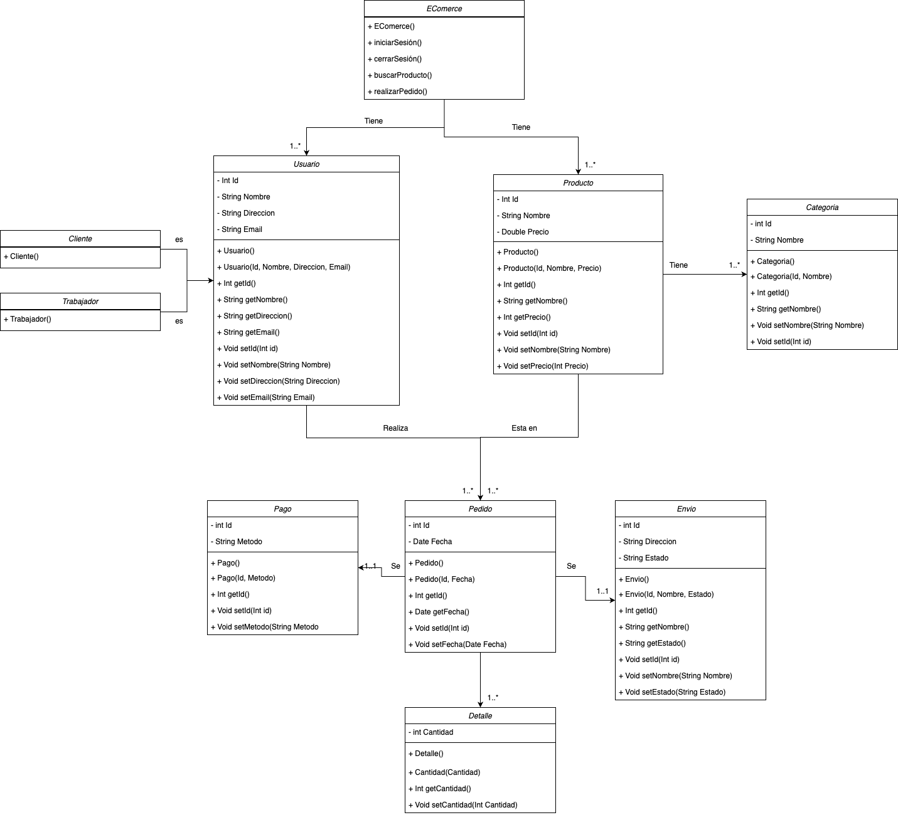

# DIAGRAMA DE CLASES UML DE COSECHA PROPIA
## Instrucciones de la actividad
Escribe un ejercicio de diagramas de clases UML como los que hemos trabajado en clase.
Debe incluir la solución.
### PARTE A OBLIGATORIA.
Debe entregar: 
- Enunciado del ejercicio.
- Imagen con la solución del ejercicio. (programa a elegir)
- Si  el ejercicio  se inspira en una página web o bibliografía, debe añadirlo.
- Debes entregar todo lo que se requiere en un repositorio de github en el que deberéis hacer colaborador.
- El repositorio debe contener el enunciado, la solución.

La solución deberá ser expuesta en clase y defendida ante el professor y sus compañeros; para ello podréis hacer uso de diapositivas y un guión.

Si no realiza el ejercicio con los puntos anteriores, la calificación de este ejercicio será 0.
Si realiza el ejercicio después de la fecha límite,  la calificación este ejercicio será 0.

### Enunciado
Estamos desarrollando un sistema de gestión para una tienda online. La tienda vende una variedad de productos, cada uno perteneciente a una categoría específica. Los usuarios pueden ser tanto clientes como trabajadores de la empresa y todos estos pueden realizar pedidos de productos y realizar pagos de estos. Además, el usuario debe poder visualizar el estado de su pedido.

